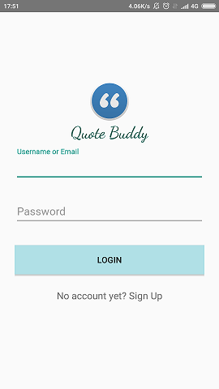
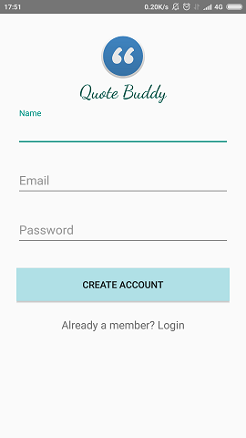
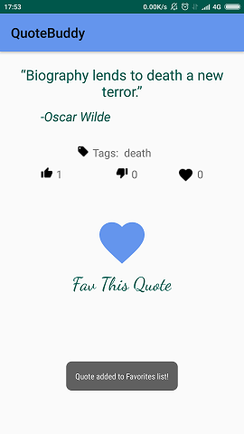
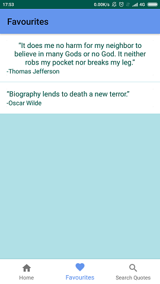
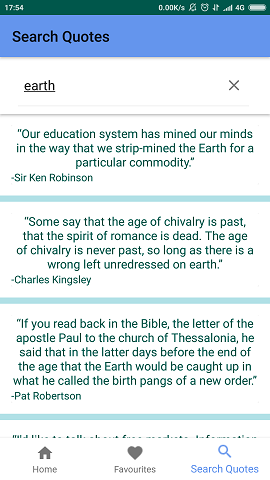

# QuoteBuddy
Your favorite Quotes on the GO

---
Android Application written in Java that allows users to keep track of their favourite quotes at FavQs 
https://favqs.com

*App Functionalities & User Guide:*

The user can login with existing FavQs credentials or sign up and create a FavQs account

 
The Main Activity provides Bottom Navigation, in the Home Section there is a random list of public quotes.
By clicking on a quote, you can browse its' contents and Fav/UnFav it.

By clicking on the quote's Author, a list of quotes by this Author is presented.
You can also click on each of this list quotes and see their content or add them to your favourites list.
In the Favourites section, all the quotes Favourited by the user are present.
You can remove a quote from the Favourites list by swiping right on it.

Finally, in the Search Quotes section, the user can search for quotes by word reference. i.e. quotes that contain the word 'earth'.

---
*Core Libraries & Dependencies Used:*

- Androidx RecyclerView
- Retrofit2.6.2 with Gson Converter (for server requests)
- Androidx CardView 
- Androidx Room 2.2.1 (for SQLite db)
- ButterKnife 10.2.0 (for ViewBinding)
- Androidx-navigation navigation-fragment (for bottom Navigation)
